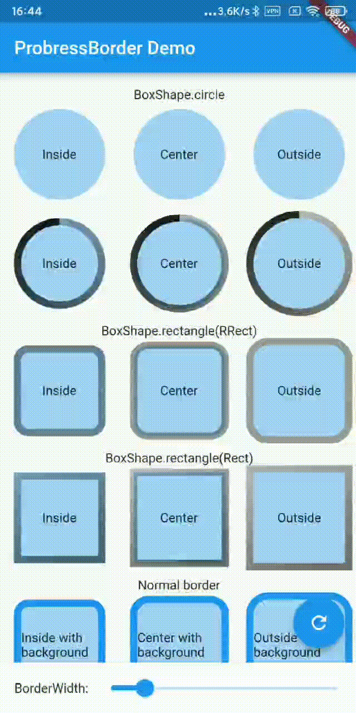

ProgressBorder
===================================
<a href="https://pub.dev/packages/progress_border">
    
</a>

A BoxBorder like Border but draw part of the border according to the progress, supported circle, rect, rectangle.

## Features

- ✅ Draw part of border
- ✅ Supported circle, reactangle
- ✅ Background Border under progress border
- 🚧 PathMetric cache
- 🚧 Custom Paint

## Preview

|ProgressBorder| |
|:-:|:-:|
|| |

## Getting started

`flutter pub add progress_border`

## Usage

```dart
Container(
    width: 100,
    height: 100,
    decoration: BoxDecoration(
        color: Colors.blue.withAlpha(100),
        border: ProgressBorder.all(
        color: Colors.blue,
        width: 8,
        progress: animationController.value,
        ),
    ),
);
```

More usage see `/example` folder.

## Additional information

To use this library in versions lower than Flutter 3.7, please specify the version number as 0.0.x.

